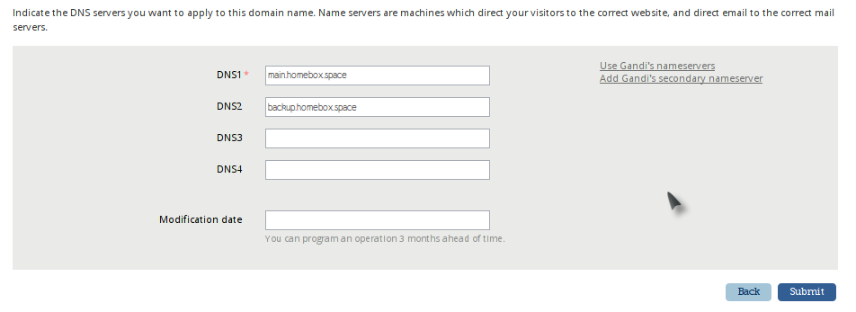
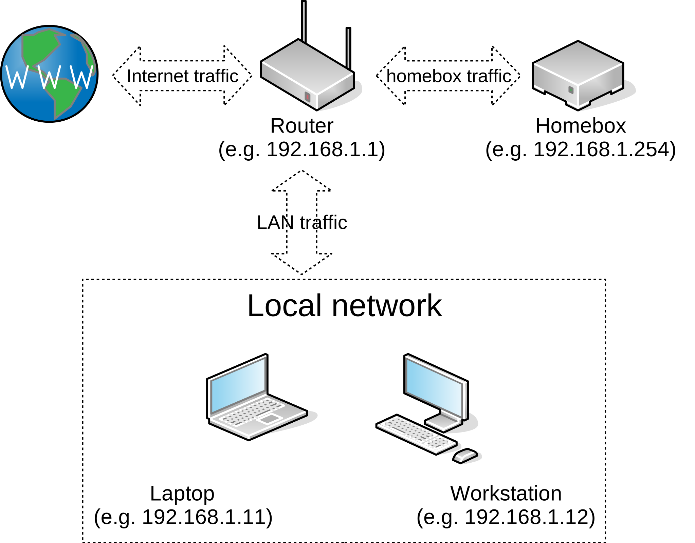

# Introduction

This section will explains all the necessary steps _before_ the installation really starts, like the DNS records or your
home network set-up.

It is not a "Self hosting for newbies", but if you follow the instructions carefully, you do not need strong technical
knowledge to achieve the above.

You still need some basic understanding though, like what is an IP address or a port, how to run Ansible in a console,
how to edit Yaml files, etc.

## Hosting emails at home

If you want seriously host your emails at home, you will need the following:

- A static IP address from your ISP (Internet Service Provider).
- Make sure your port 25 is not blocked.
- A low power consumption hardware.

Pros:

- Better privacy,
- Cheaper if you already pay for broadband with a static IP address.

Cons:

- Your internet connection and electric providers need to be stable.
- Might be cumbersome when you are moving

## Hosting emails online

Any serious hosting platform can provide a server, virtual or physical, with an externally accessible IP address. Some
providers, however, are blocking the port 25 (e.g. Google cloud).

Be careful, using a VPS (Virtual Private Server) is no more secure than hosting at your home.

Pros:

- Does not rely on the reliability of your internet connection or your electricity provider
- You can move to another address easily.

Cons:

- You may not have control on the kernel installed. This is less secure than Homebox, which is by default configured to
  run on AppArmor.
- You will not be able to use Full Disk Encryption. Although there are some security measures in places, it is still
  perfectly possible to extract data from your disk without your knowledge or consent.
- You will not have the choice on when and which security updates are applied. Most hosting providers have specific time
  windows to update the kernel images they use, which may not be as soon as you need, or even appropriate to you.
- Might be expensive, especially if you have a lot of data.

# Pre-installation steps

## Set up your domain name

The first thing you need is a domain name and a DNS provider, there are many available. For instance, here a
[list of other DNS providers](https://github.com/AnalogJ/lexicon#providers) you can use.

The screenshots and examples in this tutorial are specific to [Gandi](https://www.gandi.net/), but the principles are
the same.

Once you have chosen the domain name, it is necessary to configure the associated DNS servers, and the _glue records_.

For instance, on Gandi, you will have to set up the glue records first and then the DNS servers used for your domain:

### Glue records

Create at least one record that points to your static IP address.


### DNS servers

Add the DNS server accordingly



## Choose the hardware

An old laptop should be enough to start, with the main advantage of being somewhat resilient to power failures. I also
suggest you to have a look on this Debian page: [Cheap Serverbox Hardware](https://wiki.debian.org/FreedomBox/Hardware)
of the project freedombox, another excellent project.

The preseed configuration (see next step) provides an option to use software RAID, so you can use this as well if you
prefer.

!!! Warning
    You still need to regularly backup your data, even if you are using RAID.

## Set-up your home network

This is necessary only if you choose to use a home device to host your emails. If you are using an online server, you
can skip this section.



Ideally, you will need to configure your router to redirect all the external traffic to your homebox using the "DMZ"
functionality if there is one. The other option is to redirect only the ports you will need.

Initially, the following TCP ports are required:

- To obtain your certificates from LetsEncrypt, the port 80 need to be exposed.
- To test sending and receiving emails, your system should be accessible on the port 25 as well.
- To retrieve emails, your system should be accessible on ports 143, 993, 110, 995.
- To send emails, your system should be accessible on ports 587 and/or 465.
- For Thunderbird automatic configuration, your system should be accessible on port 80.
- Once installed, SOGo and the webmail are accessible through https (port 443).

The next step is to link your domain name (e.g homebox.me) to your static IP address that has been assigned to you by
your ISP.

## Prepare your workstation

Any workstation with a decent text editor like _Emacs_, _Vim_ or even Gedit should be enough. You will need to run the
Ansible scripts, and perhaps to install some packages, like rsync. I recommend using Linux, any flavour. For instance,
on Debian or Ubuntu:

``` sh
$ sudo apt install ansible rsync
```

If you already have a Debian server (Stretch) installed, and you prefer to use it, it's fine, you can skip the next
section and start the [installation](installation.md) directly. Otherwise, click on next to read the OS installation
page.
